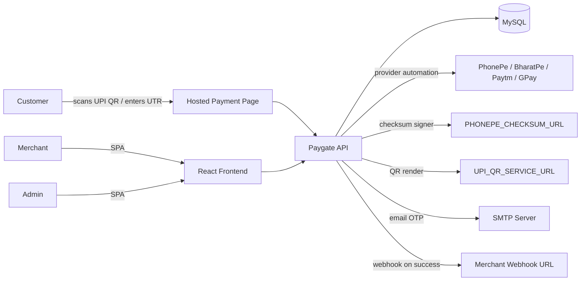
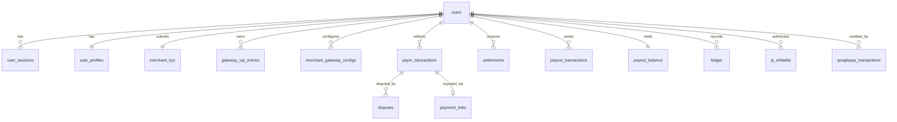
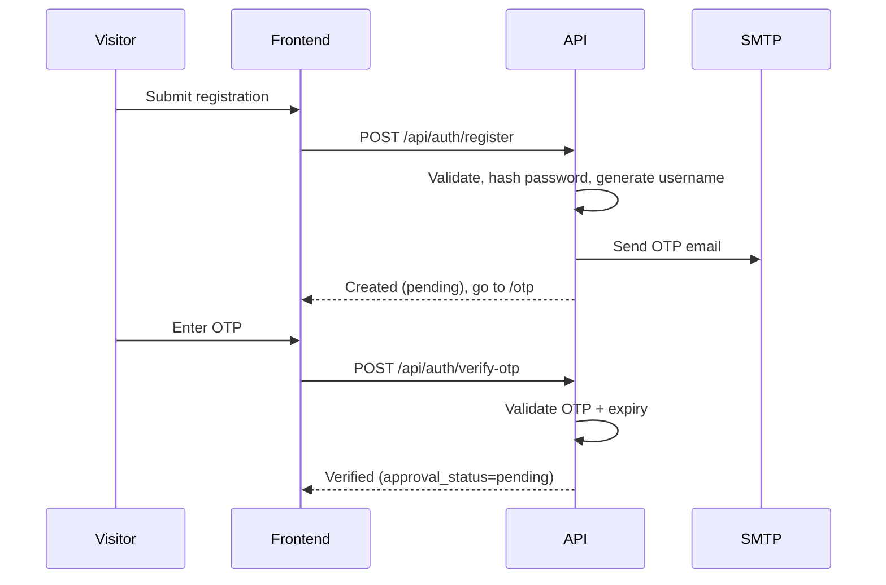
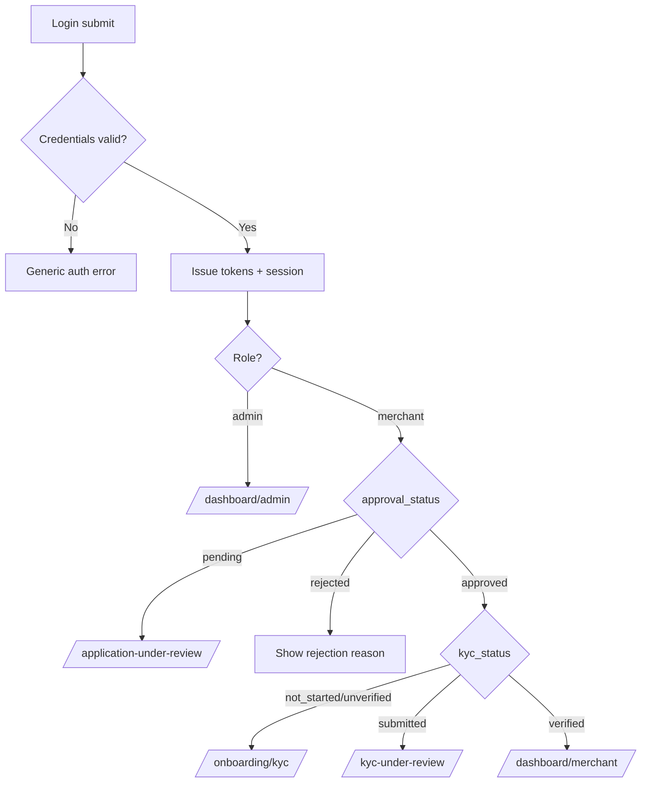
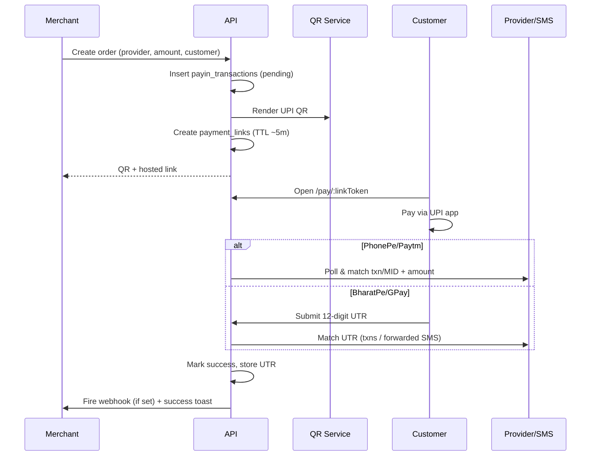
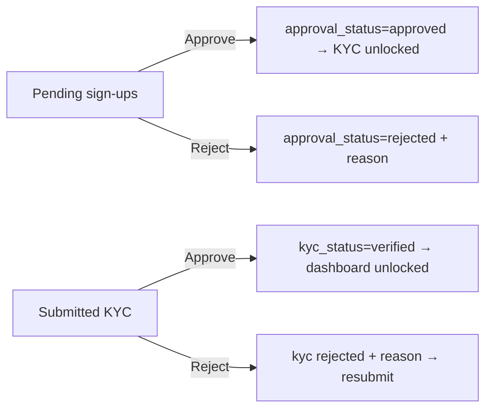
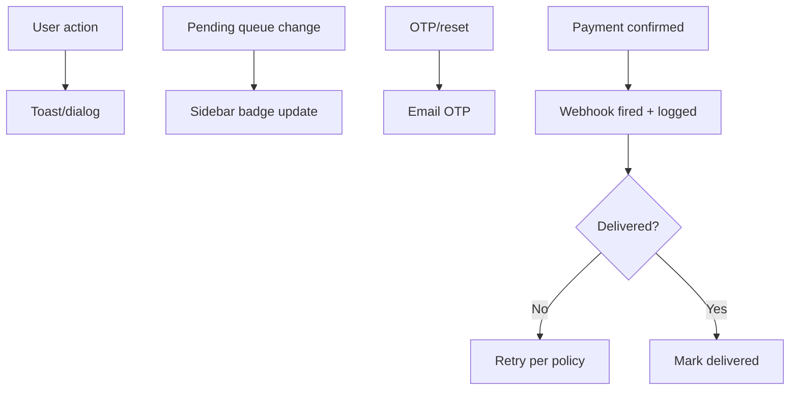
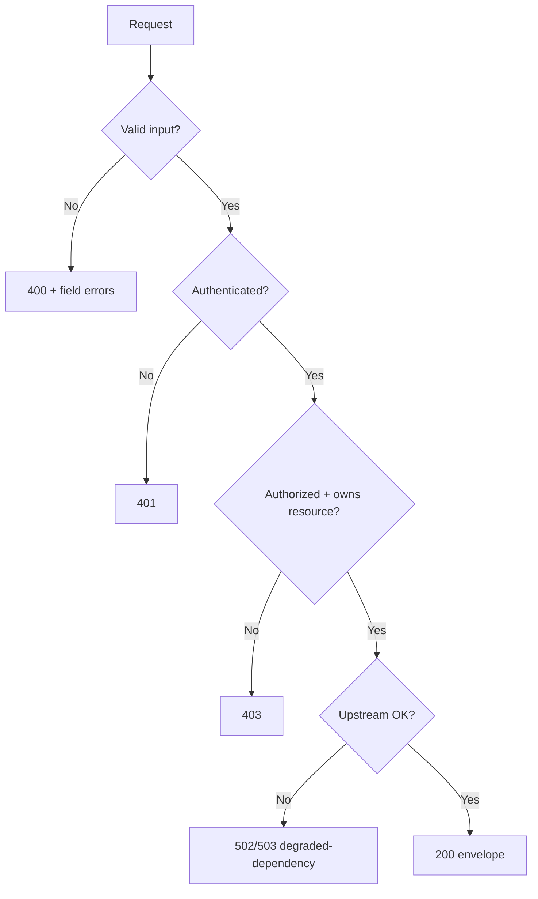

# Software Requirements Specification (SRS)

## Document Control

### Document Information

| Field | Value |
| ----- | ----- |
| **Project Name** | Paygate — UPI Payment Gateway Platform |
| **Version** | 1.0 |
| **Date** | 2026-06-16 |
| **Author** | Senior Software Architect / Technical Product Manager |
| **Status** | Draft — for engineering, design, QA, and stakeholder review |

### Revision History

| Version | Date | Author | Changes |
| ------- | ---------- | ----------------- | ------------------------------------------------ |
| 0.1 | 2026-06-10 | Architecture Team | Initial outline derived from product README. |
| 1.0 | 2026-06-16 | Architecture Team | First complete SRS baseline grounded in codebase (schema, API map, FE/BE stacks). |

---

# 1. Introduction

## 1.1 Purpose

This document specifies the complete functional and non-functional requirements for **Paygate**, a full-stack web platform that operates as a **UPI-based payment gateway** for online merchants in India. The system enables merchants to register, complete Know-Your-Customer (KYC) verification, connect their own UPI payment provider accounts (PhonePe, BharatPe, Paytm, Google Pay), collect payments from their customers, and reconcile every transaction across the **PayIn → Settlement → PayOut** lifecycle. A separate **Admin** console governs merchant approval, KYC review, and platform-wide monitoring.

The SRS is intended to be the authoritative reference for:

* Engineering teams implementing or extending the platform.
* QA teams designing verification and validation tests.
* Design teams building the user experience.
* Stakeholders evaluating scope, risk, and compliance posture.

## 1.2 Scope

**Paygate WILL:**

* Provide a public marketing landing page and self-service merchant registration with email-OTP verification.
* Provide a two-role access model: **Admin** (platform operator) and **Merchant** (business user).
* Gate merchant access behind two sequential approvals: **account approval** (by Admin) and **KYC approval** (by Admin).
* Provide a five-step KYC onboarding wizard with draft auto-save, document upload, and a review/confirmation step.
* Allow merchants to connect a UPI provider via provider-specific flows (PhonePe OTP login, BharatPe session credentials, Paytm MID, Google Pay SMS-forwarder instance).
* Allow merchants to register and manage UPI VPA entries and to create payment orders that render a dynamic UPI QR code.
* Provide a public, login-free **hosted payment page** for the merchant's customers, with provider-specific confirmation (auto-match for PhonePe/Paytm; customer-entered UTR for BharatPe/Google Pay).
* Provide role-scoped **PayIn** reporting: transactions, summary, refund callbacks, settlements, sales reports, chargebacks & liens, complaints.
* Provide role-scoped **PayOut** functions: outgoing transfers, IP whitelist, ledger, and balances.
* Provide a **Reports Center** with categorized reports prepared for CSV/PDF export.
* Provide role-aware dashboards with statistic cards and charts.
* Provide profile and account/security settings management.
* Fire merchant-configured webhooks when a payment is confirmed.

**Paygate WILL NOT (in Version 1):**

* Act as a regulated bank, PPI issuer, or licensed Payment Aggregator/Payment Gateway under RBI guidelines. (See Section 10 — this is a significant compliance assumption requiring stakeholder confirmation.)
* Provide official, certified integrations with the UPI providers. The provider collection flows are **unofficial app automations** (reverse-engineered) reliant on external helper services (a checksum signer and a QR renderer). They are documented here as functional requirements but flagged as a top-tier technical and legal risk (Section 11).
* Provide native mobile applications (iOS/Android). The product is a responsive single-page web application.
* Provide automated, real-bank settlement execution or real payout disbursement to beneficiary banks (Version 1 records and reports these; actual money movement to banks is out of scope unless integrated with a licensed disbursement rail — see Open Questions).
* Provide multi-currency support; the platform is INR-only.
* Provide an end-merchant SDK or developer API keys for programmatic order creation beyond the documented endpoints.

## 1.3 Definitions, Acronyms, and Abbreviations

| Term | Definition |
| ---- | ---------- |
| **PG** | Payment Gateway. |
| **PayIn** | Money flowing in from customers to a merchant (collections). |
| **PayOut** | Money sent out by a merchant to third parties (beneficiary transfers). |
| **Settlement** | Collected funds (minus fees and GST) paid to the merchant's bank account. |
| **UPI** | Unified Payments Interface — India's real-time inter-bank payment system. |
| **VPA** | Virtual Payment Address (e.g. `name@bank`) — the UPI handle money is paid to. |
| **UTR** | Unique Transaction Reference — a 12-digit identifier for a settled UPI/bank transaction. |
| **MID** | Merchant ID issued by a provider (e.g. Paytm). |
| **KYC** | Know Your Customer — identity/business verification process. |
| **GSTIN** | Goods and Services Tax Identification Number. |
| **IFSC** | Indian Financial System Code — identifies a bank branch. |
| **Chargeback** | A forced reversal of a payment initiated by the customer's bank. |
| **Lien** | A hold placed on funds pending dispute resolution. |
| **JWT** | JSON Web Token — used for stateless authentication. |
| **OTP** | One-Time Password — six-digit email code. |
| **SPA** | Single-Page Application. |
| **SLA** | Service Level Agreement. |
| **Webhook** | An HTTP callback fired by Paygate to a merchant-supplied URL on a payment event. |
| **Admin** | Platform operator role with cross-merchant authority. |
| **Merchant** | Business user role with access scoped to their own data. |

## 1.4 References

* IEEE Std 830-1998 — Recommended Practice for Software Requirements Specifications.
* ISO/IEC/IEEE 29148:2018 — Systems and software engineering — Life cycle processes — Requirements engineering.
* OWASP Top 10 (2021) and OWASP API Security Top 10 (2023).
* OWASP Application Security Verification Standard (ASVS).
* RBI Guidelines on Regulation of Payment Aggregators and Payment Gateways (referenced for compliance gap analysis).
* PCI DSS v4.0 (referenced for cardholder/payment data handling posture).
* India Digital Personal Data Protection Act, 2023 (DPDP Act).
* Project source artifacts: `Readme.md`, `API/schema.sql`, `API/API_FE_CONTRACT.md`, `API/API_PAYIN_CONTRACT.md`, `API/API_PAYOUT_CONTRACT.md`, `API/API_REPORTS_CONTRACT.md`, `API/paygate.postman_collection.json`.
* Technology references: React 19, React Router 7, Vite 8, Tailwind CSS 4, Node.js, Express 5, MySQL 8, JWT (RFC 7519), bcrypt.

## 1.5 Document Overview

Section 2 describes the product at a high level — perspective, functions, users, environment, and constraints. Section 3 specifies each system feature using a use-case-style template with embedded functional requirements (FR-xxx). Section 4 consolidates all functional requirements with priority and acceptance criteria. Section 5 specifies non-functional requirements. Section 6 specifies the data model and data-handling requirements. Section 7 specifies external interfaces (UI, API, third-party). Section 8 provides system workflows with Mermaid diagrams. Sections 9–13 cover reporting, compliance, risks, future considerations, and system-level acceptance criteria. Appendices provide user stories, a glossary, and open questions.

---

# 2. Overall Description

## 2.1 Product Perspective

Paygate is a **new, self-contained, two-tier web product** (React SPA frontend + Node/Express REST backend + MySQL datastore). It is not a module of a larger system; it is the system. It sits **between merchants and their customers**, mediating UPI collections and recording the downstream settlement and payout lifecycle.



The system depends on several **external services**: a remote checksum signer (`PHONEPE_CHECKSUM_URL`), a UPI QR renderer (`UPI_QR_SERVICE_URL`), a Paytm order-status endpoint (`PAYTM_STATUS_URL`), an SMTP server for OTP/notification email, and the upstream UPI provider endpoints themselves.

## 2.2 Product Functions

High-level capabilities:

1. **Public landing & marketing** — a 15-section landing page and static legal pages (Terms, Privacy).
2. **Authentication & account lifecycle** — registration, email-OTP verification, login with JWT access/refresh tokens, "remember me," forgot/reset password.
3. **Merchant onboarding gates** — Application-Under-Review and KYC-Under-Review waiting rooms; automatic routing by `approval_status` and `kyc_status`.
4. **KYC verification** — five-step wizard with draft auto-save, document upload, and review/confirmation.
5. **Admin merchant management** — approve/reject sign-ups, review/approve/reject KYC, full merchant directory, badge counts.
6. **Gateway (merchant)** — manage UPI VPA entries; connect a provider; create payment orders with QR codes; poll order status; configure webhook URL.
7. **Hosted payment page (customer-facing)** — public payment page with QR and (for UTR providers) UTR entry.
8. **PayIn reporting** — transactions, summary, refund callbacks, settlements, sales report, chargebacks & liens, complaints (role-scoped).
9. **PayOut** — outgoing transfers, IP whitelist, ledger, balances (role-scoped).
10. **Reports Center** — categorized reports prepared for CSV/PDF export.
11. **Dashboards** — role-aware stat cards and charts.
12. **Profile & settings** — profile editing, general settings, security settings.
13. **Notifications** — in-app toasts/alerts, sidebar badge counts, email OTP, and outbound webhooks.

## 2.3 User Classes and Characteristics

### 2.3.1 Admin (Platform Operator)

* **Responsibilities:** Approve/reject merchant sign-ups; review, approve, or reject KYC submissions; monitor platform-wide statistics; oversee all PayIn/PayOut records across all merchants.
* **Access Rights:** Read access to all merchants' data; write access to merchant approval and KYC review decisions; access to the **MERCHANT** management menu; platform-wide (unscoped) dashboards and reports.
* **Restrictions:** No access to the merchant-only **GATEWAY** module (cannot connect providers or collect payments on a merchant's behalf). Cannot view or recover merchant plaintext passwords or provider secrets. Admin accounts are not self-registered (provisioned/seeded).

### 2.3.2 Merchant (Business User)

* **Responsibilities:** Complete KYC; connect a payment provider; collect payments; manage their own VPA entries, payouts, IP whitelist, profile, and settings.
* **Access Rights:** Read/write access **scoped strictly to their own `user_id`** across PayIn, PayOut, Reports, Gateway, Profile, and Settings. Access to the **GATEWAY** module.
* **Restrictions:** Cannot access the **MERCHANT** management menu. Cannot view other merchants' data. Cannot reach the live dashboard until both account approval and KYC approval are granted. Cannot self-approve account or KYC.

### 2.3.3 Customer (Payer — Unauthenticated)

* **Responsibilities:** Open a hosted payment link, pay the displayed UPI QR, and (for UTR providers) enter the 12-digit UTR.
* **Access Rights:** Access only to a single, time-boxed hosted payment page (`/pay/:linkToken`). No account, no login.
* **Restrictions:** No access to any merchant or admin data; link is valid only for its TTL (~5 minutes).

### 2.3.4 System / Automation Actors (Non-human)

* **SMS Forwarder (Google Pay):** Posts incoming credit-SMS payloads to the platform for UTR matching (`googlepay ingest-sms`).
* **Webhook Consumer (Merchant systems):** Receive payment-confirmation callbacks.
* **Scheduled jobs (assumed):** Expiry of payment links, OTP cleanup, settlement aggregation.

## 2.4 Operating Environment

* **Platforms:** Cloud or on-premise Linux server (Node.js runtime) + MySQL 8.x. Frontend served as static assets (Vite production build) via any static host/CDN or the API host.
* **Browsers:** Latest two stable versions of Chrome, Firefox, Edge, and Safari (desktop and mobile). The SPA targets evergreen browsers compatible with the Vite/React 19 toolchain.
* **Mobile Support:** Responsive web (no native app). The hosted payment page must function on mobile browsers, since customers typically pay from a phone.
* **Hosting Requirements:** Node.js 18+ runtime; MySQL 8.x (InnoDB, utf8mb4); persistent file storage for the `uploads/` KYC documents directory; outbound network access to provider endpoints, the checksum signer, the QR renderer, and the SMTP server; HTTPS termination (TLS) at the edge.
* **Third-Party Dependencies:**
  * Backend: `@phonepe-pg/pg-sdk-node`, `paytm-pg-node-sdk`, `express`, `mysql2`, `jsonwebtoken`, `bcrypt`, `nodemailer`, `cookie-parser`, `cors`, `dotenv`, `axios`.
  * Frontend: `react`, `react-dom`, `react-router-dom`, `vite`, `tailwindcss`, `recharts`, `axios`, `react-hook-form`, `yup`, `react-hot-toast`, `react-toastify`, `sweetalert2`, `jspdf`, `pdfjs-dist`, `lucide-react`, `react-icons`.
  * External services: `PHONEPE_CHECKSUM_URL`, `UPI_QR_SERVICE_URL`, `PAYTM_STATUS_URL`, SMTP relay, upstream provider APIs.

## 2.5 Design and Implementation Constraints

**Technical constraints:**

* Frontend: React 19 SPA built with Vite 8; styling with Tailwind CSS 4. Routing via React Router 7. State/auth persisted in `localStorage`.
* Backend: Node.js + Express 5 (CommonJS). **MySQL accessed via the `mysql2` driver with raw SQL** — no ORM. Schema is a single source of truth (`schema.sql`); there are no incremental migrations.
* Authentication: JWT access + refresh tokens; bcrypt password hashing; refresh sessions persisted in `user_sessions`.
* Standard JSON response envelope across most endpoints (Section 7.2); list endpoints include a `pagination` object.
* Provider integrations are **unofficial automations** dependent on external helper services and live provider sessions.

**Regulatory constraints:**

* Operates in the Indian payments domain; subject to RBI payment-aggregator guidelines, DPDP Act, and GST treatment of fees. (See Sections 10 and 11 and Appendix C — these constraints are not yet confirmed satisfied and represent open compliance questions.)

**Security constraints:**

* All protected routes require `Authorization: Bearer <accessToken>`.
* Every merchant-scoped query MUST be filtered by `user_id` on the backend; frontend route guards alone are insufficient.
* Provider secrets, sessions, and webhook credentials are sensitive and MUST NOT be exposed to the frontend or logs.
* `PHONEPE_TLS_INSECURE=true` disables TLS verification for PhonePe's edge and MUST NOT be used in production.

**Performance constraints:**

* List endpoints MUST be paginated. Status polling on the Collect/Hosted pages must not overwhelm the API or upstream providers.

## 2.6 Assumptions and Dependencies

1. **A-01:** The platform operates INR-only.
2. **A-02:** Each merchant connects their own provider business account; the platform does not hold pooled provider credentials.
3. **A-03:** External helper services (checksum signer, QR renderer, Paytm status endpoint) are available and reachable; their outages degrade or block payment collection.
4. **A-04:** An SMTP server is configured for OTP and notification email.
5. **A-05:** Admin accounts are provisioned out-of-band (seeded), not self-registered.
6. **A-06:** Settlement, ledger, balance, dispute, and payout records may be seeded/recorded data in Version 1; the SRS treats actual bank money-movement as out of scope pending integration with a licensed rail (Open Question OQ-03).
7. **A-07:** The hosted payment link TTL is ~5 minutes.
8. **A-08:** Customers have a UPI-capable app to scan the QR and the ability to read the UTR after payment.
9. **A-09:** Persistent disk storage is available for uploaded KYC documents (`uploads/`).
10. **A-10:** TLS is terminated at the edge; the application is always served over HTTPS in production.

---

# 3. System Features

Each feature below uses a use-case template. Functional requirements are numbered FR-xxx and consolidated in Section 4.

## 3.1 Feature: Merchant Registration & Email-OTP Verification

### Description
Self-service merchant sign-up collecting first name, last name, email, phone number, and password, followed by a six-digit email OTP to verify the address. On verification, a merchant account is created in `pending` approval status with an auto-generated unique username.

### Business Value
Enables frictionless, verified onboarding while ensuring every account starts in a controlled `pending` state subject to admin approval.

### Actors
Prospective Merchant (unauthenticated); Email/SMTP (system).

### Preconditions
The email and phone number are not already registered.

### Trigger
Visitor submits the registration form.

### Main Flow
1. Visitor submits `firstName`, `lastName`, `email`, `phoneNumber`, `password`.
2. Backend validates input, hashes the password (bcrypt), generates a unique username, and creates the user.
3. Backend generates a six-digit OTP, stores it with an expiry, and emails it.
4. Visitor enters the OTP on `/otp`.
5. On match within expiry, account is marked verified; account remains `approval_status = pending`, `kyc_status = unverified`.

### Alternative Flows
* **A1 — Resend OTP:** Visitor requests a new OTP; a fresh code is generated and the previous invalidated.

### Exception Flows
* **E1 — Duplicate email/phone:** Registration rejected with a clear message.
* **E2 — Expired OTP:** Verification fails; user prompted to resend.
* **E3 — Email delivery failure:** User informed; allowed to retry/resend.

### Postconditions
A verified, `pending` merchant account exists awaiting admin approval.

### Functional Requirements
FR-001, FR-002, FR-003, FR-004.

## 3.2 Feature: Authentication (Login, Tokens, Sessions, Logout)

### Description
Email + password login issuing JWT access and refresh tokens, persisting a refresh session (`user_sessions`) with IP/user-agent, and routing the user by role and onboarding status. Supports "remember me," refresh, current-user (`/me`), and logout.

### Business Value
Secure, stateless authentication with role- and status-aware routing is the backbone of all access control.

### Actors
Admin; Merchant.

### Preconditions
A verified account exists.

### Trigger
User submits the login form.

### Main Flow
1. Client validates email format and password (≥ 8 chars, letters + numbers).
2. Backend verifies credentials against the bcrypt hash.
3. Backend issues access + refresh tokens; persists a refresh session row with `ip_address`, `user_agent`, `expires_at`.
4. Backend returns user info, role, and onboarding status.
5. Frontend stores tokens/user in `localStorage` and routes per Section 5/8 rules.

### Alternative Flows
* **A1 — Remember me:** Email is stored locally for prefill.
* **A2 — Token refresh:** Expired access token is refreshed using a valid, non-revoked refresh token.

### Exception Flows
* **E1 — Invalid credentials:** Generic failure message (no user enumeration).
* **E2 — Revoked/expired refresh token:** User forced to re-login.
* **E3 — Pending/rejected account or incomplete KYC:** User routed to the corresponding waiting room rather than the live dashboard.

### Postconditions
An authenticated session with valid tokens; user routed to the correct destination.

### Functional Requirements
FR-005, FR-006, FR-007, FR-008, FR-009.

## 3.3 Feature: Password Reset (Forgot / Reset)

### Description
Email-OTP-based password reset: request a reset OTP, verify it, and set a new password.

### Business Value
Self-service recovery reduces support load and lockouts.

### Actors
Registered user; Email/SMTP.

### Preconditions
The email belongs to an existing account.

### Trigger
User submits the forgot-password form.

### Main Flow
1. User submits email → backend issues a reset OTP via email.
2. User verifies the OTP on `/otp` (reset flow context).
3. User sets a new password on `/reset-password`; backend validates and updates the bcrypt hash.

### Alternative Flows
* **A1 — Resend reset OTP.**

### Exception Flows
* **E1 — Unknown email:** Respond uniformly to avoid account enumeration.
* **E2 — Expired/invalid OTP:** Reset blocked; prompt to retry.
* **E3 — Weak new password:** Rejected with policy guidance.

### Postconditions
Password updated; existing sessions optionally invalidated (see FR-012).

### Functional Requirements
FR-010, FR-011, FR-012.

## 3.4 Feature: Merchant Onboarding Gates & Routing

### Description
Automatic routing of merchants to the correct screen based on `approval_status` and `kyc_status`: Application-Under-Review (pending), KYC wizard (approved + KYC not started), KYC-Under-Review (submitted), or live dashboard (KYC approved).

### Business Value
Enforces the two-gate compliance funnel and prevents premature gateway access.

### Actors
Merchant.

### Preconditions
Authenticated merchant.

### Trigger
Merchant logs in or navigates within the app.

### Main Flow
1. On each protected navigation, the system evaluates status:
   * `pending` → `/application-under-review`.
   * `approved` + KYC `not_started` → `/onboarding/kyc`.
   * KYC `submitted` → `/kyc-under-review`.
   * KYC `approved` → `/dashboard/merchant`.

### Alternative Flows
* **A1 — Rejected account/KYC:** Merchant sees the rejection reason and appropriate next step.

### Exception Flows
* **E1 — Status desync:** Backend remains the source of truth; frontend re-fetches status on load.

### Postconditions
Merchant is always on the screen appropriate to their status.

### Functional Requirements
FR-013, FR-014.

## 3.5 Feature: KYC Verification Wizard

### Description
A five-step wizard collecting Personal Information, Business Information, Documents, Bank Account Details, and a Review/Confirmation step, with draft auto-save on step change and on demand. Submission moves KYC to `submitted`.

### Business Value
Captures the regulatory and operational data required to activate a merchant safely.

### Actors
Merchant; File storage (system).

### Preconditions
Account `approved`; KYC `not_started` or draft in progress.

### Trigger
Merchant opens `/onboarding/kyc`.

### Main Flow
1. **Step 1 — Personal:** name, DOB, gender, nationality, address, city, state, PIN, ID type & number.
2. **Step 2 — Business:** legal name, business type, GSTIN, business PAN (optional), registered address, website (optional).
3. **Step 3 — Documents:** identity document (front/back), required supporting documents.
4. **Step 4 — Bank:** account holder, bank name, IFSC, account number, account type, passbook upload.
5. **Step 5 — Review:** read-only summary with document previews; confirmation checkbox required; optional print/save.
6. On submit, `merchant_kyc.status = submitted`; merchant routed to `/kyc-under-review`.

### Alternative Flows
* **A1 — Save Draft:** Persists `draft_data` + `draft_current_step` + `draft_saved_at`; progress restored on return.
* **A2 — Resume:** Returning to the wizard reopens at the saved step with prefilled data.

### Exception Flows
* **E1 — Invalid field/file:** Step-level validation blocks progress with messages.
* **E2 — Upload failure:** User informed; can retry; draft retains other fields.
* **E3 — Submit without confirmation checkbox:** Submission blocked.

### Postconditions
KYC submitted and queued for admin review.

### Functional Requirements
FR-015, FR-016, FR-017, FR-018, FR-019.

## 3.6 Feature: Admin — Merchant Account Approval

### Description
Admin lists pending sign-ups and approves (unlocking KYC) or rejects (with reason). Drives a sidebar badge count.

### Business Value
Gatekeeping ensures only vetted businesses progress.

### Actors
Admin.

### Preconditions
At least one `pending` merchant exists.

### Trigger
Admin opens `/merchant/new-request`.

### Main Flow
1. Admin views the pending list (`GET /api/auth/admin/merchants/pending`).
2. Admin approves → `approval_status = approved`, `approved_at`, `approved_by` set; merchant can start KYC.
3. Admin rejects → `approval_status = rejected`, `rejection_reason`, `rejected_at`, `rejected_by` set.

### Alternative Flows
* **A1 — Bulk view/filter/search** of pending requests.

### Exception Flows
* **E1 — Already-decided merchant:** Re-decision blocked or audited.

### Postconditions
Merchant's account status updated; badge count refreshed.

### Functional Requirements
FR-020, FR-021, FR-022.

## 3.7 Feature: Admin — KYC Review & Decision

### Description
Admin lists submitted KYC, opens a full detail view of all personal/business/bank fields and uploaded documents (with previews), and approves (unlocking the dashboard) or rejects (with reason).

### Business Value
Final compliance gate before a merchant can transact.

### Actors
Admin.

### Preconditions
At least one merchant with `merchant_kyc.status = submitted`.

### Trigger
Admin opens `/merchant/kyc-requests` or a detail page.

### Main Flow
1. Admin views submitted KYC list.
2. Admin opens detail (`/merchant/kyc-review/:email`), reviews all fields and document previews.
3. Admin approves → `merchant_kyc.status = approved`, `approved_by/at`; user `kyc_status = verified`; dashboard unlocked.
4. Admin rejects → status `rejected` with reason; merchant notified.

### Alternative Flows
* **A1 — Approve/reject directly from the list** with confirmation dialog.

### Exception Flows
* **E1 — Missing/corrupt document:** Admin can reject with reason; merchant must resubmit.

### Postconditions
KYC decision recorded; merchant routed accordingly.

### Functional Requirements
FR-023, FR-024, FR-025.

## 3.8 Feature: Admin — Merchant Directory

### Description
Complete directory of all merchants with account status, KYC status, and key details.

### Business Value
Single pane for platform oversight.

### Actors
Admin.

### Preconditions
Authenticated admin.

### Trigger
Admin opens `/merchant/all`.

### Main Flow
1. Admin views all merchants (`GET /api/auth/admin/merchants/manager`) with search/filter/pagination.

### Alternative Flows
* **A1 — Filter by status; search by name/email.**

### Exception Flows
* **E1 — Empty directory:** Friendly empty state.

### Postconditions
Admin has full visibility of the merchant base.

### Functional Requirements
FR-026.

## 3.9 Feature: Gateway — UPI VPA Entry Management (Merchant)

### Description
Merchant registers a business mobile number against a UPI platform, looks up the resulting UPI ID, lists/adds entries, toggles active/inactive, and deletes entries.

### Business Value
Establishes the destination VPA that customer payments are directed to.

### Actors
Merchant; Provider lookup service.

### Preconditions
Merchant has dashboard access (KYC approved).

### Trigger
Merchant opens `/gateway`.

### Main Flow
1. Merchant enters business mobile + UPI platform → lookup (`POST /api/payments/gateway/upi/lookup`); for BharatPe the stored session auto-discovers the `...@fbpe` VPA.
2. Merchant adds the entry (`{businessMobileNumber, upiPlatformId, upiId, status}`).
3. Merchant lists, toggles status, or deletes entries.

### Alternative Flows
* **A1 — Manual UPI ID entry** where lookup is unavailable.

### Exception Flows
* **E1 — Lookup failure / invalid session:** Error surfaced; entry not created.
* **E2 — Duplicate (user, mobile, platform):** Rejected by unique constraint.

### Postconditions
Active VPA entries available for collection.

### Functional Requirements
FR-027, FR-028, FR-029.

## 3.10 Feature: Gateway — Connect Provider (Merchant)

### Description
Provider onboarding for one of four providers, each with its own connect method: PhonePe (OTP login + store selection), BharatPe (session token + cookie + MID, live-validated), Paytm (MID + VPA), Google Pay (instance issuance for an SMS forwarder). Optional webhook URL configuration.

### Business Value
Connecting a provider activates the merchant's ability to collect payments.

### Actors
Merchant; Provider APIs; Checksum signer.

### Preconditions
Merchant has dashboard access.

### Trigger
Merchant opens `/gateway/connect` and selects a provider.

### Main Flow
1. **PhonePe:** enter business mobile → receive OTP → verify → pick a store → gateway activated.
2. **BharatPe:** paste session (token + cookie + MID) → live-validate → auto-discover UPI ID.
3. **Paytm:** enter MID + UPI VPA.
4. **Google Pay:** issue `instanceId`/`instanceSecret` for an SMS forwarder.
5. Merchant optionally sets a webhook URL.
6. Config persisted in `merchant_gateway_configs`; `status = active` on success.

### Alternative Flows
* **A1 — Re-connect/refresh** an expired session.

### Exception Flows
* **E1 — Invalid OTP / invalid session / unreachable provider:** Connection fails with a clear message; config stays `pending`/`inactive`.
* **E2 — Checksum signer unavailable (PhonePe):** Connection/collection blocked; surfaced as a degraded-dependency error.

### Postconditions
An active provider configuration enabling collection.

### Functional Requirements
FR-030, FR-031, FR-032, FR-033, FR-034.

## 3.11 Feature: Gateway — Collect Payment / Create Order (Merchant)

### Description
Merchant creates a payment order against an active gateway, receiving a UPI QR/payment URL and a hosted payment link; the page polls order status until confirmation.

### Business Value
The core money-collection action of the platform.

### Actors
Merchant; Provider APIs; QR renderer.

### Preconditions
At least one active provider configuration and active VPA.

### Trigger
Merchant submits the Collect Payment form.

### Main Flow
1. Merchant selects provider; enters customer name, phone, amount, optional order ID.
2. Backend creates the order (`payin_transactions` row, `pending`), generates a UPI string, renders a QR (`UPI_QR_SERVICE_URL`), and creates a `payment_links` token (~5-min TTL).
3. Frontend displays the QR + hosted link and polls status:
   * **PhonePe/Paytm** — backend auto-matches provider transaction history/order-status.
   * **BharatPe/Google Pay** — UTR providers; confirmation requires a customer-entered UTR.
4. On confirmation, order → `success`, UTR stored, webhook fired (if set), success toast shown.

### Alternative Flows
* **A1 — Order ID auto-generated** when not supplied.

### Exception Flows
* **E1 — Provider/QR service failure:** Order creation fails; user informed.
* **E2 — Timeout/expiry:** Link expires; order remains `pending`/`failed`; merchant may recreate.
* **E3 — Duplicate UTR (BharatPe/GPay):** Rejected.

### Postconditions
A tracked order whose terminal state is recorded and (on success) webhook-notified.

### Functional Requirements
FR-035, FR-036, FR-037, FR-038.

## 3.12 Feature: Hosted Payment Page (Customer-Facing)

### Description
A public, login-free page at `/pay/:linkToken` showing the order amount and a fresh UPI QR; for UTR providers, a field to enter the 12-digit UTR. Provider-specific confirmation logic applies.

### Business Value
The customer touchpoint that completes collection; must be simple, fast, and mobile-friendly.

### Actors
Customer (unauthenticated); Provider/SMS-match backend.

### Preconditions
A valid, unexpired payment link.

### Trigger
Customer opens the hosted link.

### Main Flow
1. Page loads order amount + UPI QR for the merchant's VPA.
2. Customer pays via any UPI app.
3. **UTR providers:** customer enters the 12-digit UTR; backend matches it (BharatPe against merchant transactions; Google Pay against today's forwarded credit SMS).
4. **PhonePe/Paytm:** backend polls and matches transaction ID/MID + amount.
5. On success, order → `success`; UTR stored; webhook fired.

### Alternative Flows
* **A1 — Customer reloads:** Page reflects current order status.

### Exception Flows
* **E1 — Expired/invalid link:** Friendly expiry message; no payment accepted.
* **E2 — Duplicate/invalid UTR:** Rejected with guidance.
* **E3 — No matching credit found:** Order stays pending; customer prompted to wait/retry.

### Postconditions
Order confirmed or left pending/expired; no customer data persisted beyond what's needed for matching.

### Functional Requirements
FR-039, FR-040, FR-041, FR-042.

## 3.13 Feature: Google Pay SMS Ingestion

### Description
An external SMS forwarder posts incoming UPI credit-SMS payloads to the platform; the backend parses amount/UTR and stores them (`googlepay_transactions`) for UTR matching, deduplicated by UTR.

### Business Value
Enables Google Pay collections without an official API.

### Actors
SMS Forwarder (authenticated via instance credentials).

### Preconditions
A Google Pay instance was issued and the forwarder is configured.

### Trigger
Forwarder posts a credit SMS (`googlepay ingest-sms`).

### Main Flow
1. Forwarder authenticates with `instanceId`/`instanceSecret`.
2. Backend parses amount, UTR, name, timestamp; inserts a `googlepay_transactions` row (dedup on UTR).

### Alternative Flows
* **A1 — Non-credit SMS:** Ignored.

### Exception Flows
* **E1 — Duplicate UTR:** Insert skipped (unique constraint).
* **E2 — Unparseable SMS:** Logged and discarded.
* **E3 — Bad instance credentials:** Request rejected.

### Postconditions
Credit available for matching customer-entered UTRs.

### Functional Requirements
FR-043, FR-044.

## 3.14 Feature: PayIn Reporting Module

### Description
Role-scoped PayIn views: Transactions, Summary, Refund Callbacks, Settlements, Sales Report, Chargebacks & Liens, Complaints — with consistent search/filter/pagination on list pages.

### Business Value
Operational transparency and reconciliation across collections.

### Actors
Admin (all merchants); Merchant (own data).

### Preconditions
Authenticated user with dashboard access.

### Trigger
User opens a PayIn page.

### Main Flow
1. **Transactions** (`GET /api/payin/transactions`): paginated list; filter by status (success/failed/pending/refunded); search.
2. **Summary** (`GET /api/payin/summary`): success rate, revenue, settlement, volume, avg ticket.
3. **Refund Callback** (`GET /api/payin/refund-callbacks`): refunded-state events.
4. **Settlements** (`GET /api/payin/settlements`): gross, fees, GST, net, status, date, merchant.
5. **Sales Report** (`GET /api/payin/sales-report`): daily/weekly/monthly cards + mix + volume chart.
6. **Chargebacks & Liens** (`GET /api/payin/chargebacks-liens`): disputes of type chargeback/lien.
7. **Complaints** (`GET /api/payin/complaints`): complaints with status/priority/timeline.

### Alternative Flows
* **A1 — Admin scope vs merchant scope** applied automatically by backend.

### Exception Flows
* **E1 — No records:** Empty state.

### Postconditions
User has scoped visibility of PayIn activity.

### Functional Requirements
FR-045, FR-046, FR-047, FR-048, FR-049, FR-050, FR-051.

## 3.15 Feature: PayOut Module

### Description
Role-scoped PayOut views: outgoing Transactions, IP Whitelist (add/edit), Ledger, and Balance cards.

### Business Value
Tracks money movement out and the merchant's running balance.

### Actors
Admin (all); Merchant (own).

### Preconditions
Authenticated user with dashboard access.

### Trigger
User opens a PayOut page.

### Main Flow
1. **Transactions** (`GET /api/payout/transactions`): outgoing transfers with beneficiary, bank, amount, status, time.
2. **IP Whitelist** (`GET /api/payout/ip-whitelist`; `POST`/`PATCH`): manage IPs allowed to trigger payouts.
3. **Ledger** (`GET /api/payout/ledger`): credit/debit entries with running balance and reference.
4. **Balance** (`GET /api/payout/balance`): available, pending, settlement balances.

### Alternative Flows
* **A1 — Admin platform-wide vs merchant-scoped data.**

### Exception Flows
* **E1 — Invalid IP format:** Rejected with validation message.

### Postconditions
User has scoped visibility/control of payout activity.

### Functional Requirements
FR-052, FR-053, FR-054, FR-055.

## 3.16 Feature: Reports Center

### Description
A Report Center presenting categories — Transaction, Settlement, Revenue, Merchant reports — prepared for CSV/PDF export and reconciliation, backed by report endpoints.

### Business Value
Consolidated analytics and exportable records for finance and operations.

### Actors
Admin; Merchant.

### Preconditions
Authenticated user with dashboard access.

### Trigger
User opens the Reports page.

### Main Flow
1. User views report categories (`GET /api/reports/center`).
2. User triggers CSV/PDF export of a selected report.
3. Supporting endpoints supply data: `/api/reports/sales`, `/api/reports/merchant`, `/api/reports/summary`.

### Alternative Flows
* **A1 — Legacy alias** `GET /api/payin/reports` supported.

### Exception Flows
* **E1 — Export with no data:** Empty/zero-row file or informative message.

### Postconditions
User obtains the requested report/export.

### Functional Requirements
FR-056, FR-057.

## 3.17 Feature: Role-Aware Dashboard

### Description
A single dashboard page rendering role-scoped stat cards and charts from `GET /api/dashboard/summary`. Admin sees seven platform-wide cards; merchant sees eight scoped cards.

### Business Value
At-a-glance health and performance for each role.

### Actors
Admin; Merchant.

### Preconditions
Authenticated user with dashboard access.

### Trigger
User lands on `/dashboard/admin` or `/dashboard/merchant`.

### Main Flow
1. Backend returns stats + chart series + recent transactions, scoped by role.
2. Frontend renders cards, Recharts visualizations, and a recent-transactions table.

### Alternative Flows
* **A1 — Admin charts scaled** to represent platform-wide totals.

### Exception Flows
* **E1 — Sparse data:** Charts/cards render zero/empty states gracefully.

### Postconditions
User views their role-appropriate dashboard.

### Functional Requirements
FR-058, FR-059.

## 3.18 Feature: Profile & Settings

### Description
Profile editing (name, phone, job title, department, bio, location, avatar, DOB) and account/security settings (general preferences; password/security controls; IP whitelist read/write).

### Business Value
User self-management and account security hardening.

### Actors
Admin; Merchant.

### Preconditions
Authenticated user.

### Trigger
User opens Profile or Settings.

### Main Flow
1. **Profile** (`GET/PATCH /api/profile`): view/edit extended profile fields.
2. **Settings** (`/settings`): general preferences.
3. **Security** (`/settings/security`): security controls; `/security-center` redirects here.
4. **IP whitelist** (`/api/settings` read/write).

### Alternative Flows
* **A1 — Avatar upload/replace.**

### Exception Flows
* **E1 — Invalid field/file:** Validation errors surfaced; save blocked.

### Postconditions
Updated profile/settings persisted.

### Functional Requirements
FR-060, FR-061, FR-062.

## 3.19 Feature: Notifications

### Description
In-app toasts/alerts (react-hot-toast / react-toastify / SweetAlert2), sidebar badge counts (pending merchant/KYC requests for admins), email OTP, and outbound webhooks on payment confirmation.

### Business Value
Timely feedback and event propagation to users and merchant systems.

### Actors
All roles; Merchant webhook consumers; SMTP.

### Preconditions
Relevant event occurs.

### Trigger
A system event (success/error, pending count change, OTP, payment confirmed).

### Main Flow
1. UI shows a toast/dialog for user actions.
2. Sidebar badges reflect pending admin queues.
3. OTP emails are sent for verification/reset.
4. On payment confirmation, the merchant's webhook URL is invoked.

### Alternative Flows
* **A1 — Notification bell** surfaces recent events in the navbar.

### Exception Flows
* **E1 — Webhook delivery failure:** Logged; retry policy applied (see FR-038/FR-064).

### Postconditions
Stakeholders are informed of events.

### Functional Requirements
FR-063, FR-064.

---

# 4. Functional Requirements

Priority legend: **Critical** (blocks launch), **High**, **Medium**, **Low**.

### FR-001 — Merchant Registration
**Description:** The system shall let a visitor register with first name, last name, email, phone number, and password; create the user with a bcrypt-hashed password and an auto-generated unique username.
**Priority:** Critical
**Acceptance Criteria:** Valid submission creates one user row (`role=merchant`, `approval_status=pending`, `kyc_status=unverified`); username is unique; password is never stored in plaintext; duplicate email/phone is rejected.

### FR-002 — Email OTP Issuance
**Description:** On registration, the system shall generate a six-digit OTP with an expiry and email it.
**Priority:** Critical
**Acceptance Criteria:** `otp_code` (6 digits) and `otp_expires_at` are set; an email is dispatched; expired/used OTPs are invalid.

### FR-003 — OTP Verification
**Description:** The system shall verify the OTP for both sign-up and reset flows and remember which flow is active.
**Priority:** Critical
**Acceptance Criteria:** Correct OTP within expiry marks `otp_verified_at`; incorrect/expired OTP is rejected; the correct post-verification route is taken per flow.

### FR-004 — Resend OTP
**Description:** The system shall allow resending a fresh OTP, invalidating the prior one.
**Priority:** High
**Acceptance Criteria:** A new OTP replaces the old; the old code no longer verifies.

### FR-005 — Login Authentication
**Description:** The system shall authenticate by email + password against the bcrypt hash.
**Priority:** Critical
**Acceptance Criteria:** Valid credentials succeed; invalid credentials return a generic error without revealing whether the email exists.

### FR-006 — Client-Side Login Validation
**Description:** The login form shall validate email format and password (≥ 8 chars, containing letters and numbers).
**Priority:** Medium
**Acceptance Criteria:** Submission is blocked client-side until inputs are valid; server-side validation is also enforced.

### FR-007 — JWT Issuance & Refresh Sessions
**Description:** On login the system shall issue access + refresh JWTs and persist a `user_sessions` row with `ip_address`, `user_agent`, `expires_at`, `is_revoked=0`.
**Priority:** Critical
**Acceptance Criteria:** Tokens are returned; a session row exists; refresh succeeds only with a valid, non-revoked token.

### FR-008 — Role/Status-Based Routing
**Description:** After login the system shall route the user by role and onboarding status (Section 8.2).
**Priority:** Critical
**Acceptance Criteria:** Admin → `/dashboard/admin`; merchant routed to the correct gate or `/dashboard/merchant`.

### FR-009 — Current User & Logout
**Description:** The system shall expose `/me` (current user) and a logout that revokes the refresh session.
**Priority:** High
**Acceptance Criteria:** `/me` returns the authenticated user; logout sets `is_revoked=1`; the revoked token cannot refresh.

### FR-010 — Forgot Password
**Description:** The system shall send a reset OTP to a submitted email.
**Priority:** High
**Acceptance Criteria:** A reset OTP is emailed; response does not reveal whether the email exists.

### FR-011 — Reset Password
**Description:** After OTP verification the system shall let the user set a new password meeting policy.
**Priority:** High
**Acceptance Criteria:** New password is bcrypt-hashed and stored; weak passwords are rejected.

### FR-012 — Session Invalidation on Reset
**Description:** On password reset the system shall revoke existing refresh sessions.
**Priority:** Medium
**Acceptance Criteria:** After reset, prior refresh tokens are revoked and cannot refresh.

### FR-013 — Onboarding Status Evaluation
**Description:** The system shall determine the correct merchant screen from `approval_status` and `kyc_status` on every protected navigation, with the backend as source of truth.
**Priority:** Critical
**Acceptance Criteria:** Each status maps to the screen defined in Section 3.4; manual URL manipulation cannot bypass gates (backend re-checks).

### FR-014 — Rejection Visibility
**Description:** The system shall display the rejection reason for rejected accounts/KYC.
**Priority:** Medium
**Acceptance Criteria:** Rejected users see the stored `rejection_reason` and the next available step.

### FR-015 — KYC Five-Step Capture
**Description:** The system shall collect personal, business, document, and bank data across the five-step wizard.
**Priority:** Critical
**Acceptance Criteria:** All required fields per step are validated; mandatory documents are required; final review reflects all entries.

### FR-016 — KYC Draft Auto-Save
**Description:** The system shall save a draft on step change and on demand, persisting `draft_data`, `draft_current_step`, `draft_saved_at`.
**Priority:** High
**Acceptance Criteria:** Returning to the wizard restores the saved step and data; no entered data is lost across navigation.

### FR-017 — KYC Document Upload
**Description:** The system shall accept identity (front/back) and supporting/bank documents, storing them in `uploads/`.
**Priority:** Critical
**Acceptance Criteria:** Files are validated by type/size; stored securely; previewable in review and by admin; not publicly accessible without authorization.

### FR-018 — KYC Review Confirmation
**Description:** The review step shall require an explicit confirmation checkbox before submission and allow print/save of the summary.
**Priority:** High
**Acceptance Criteria:** Submission is blocked until the checkbox is ticked; a PDF/printable summary is producible.

### FR-019 — KYC Submission
**Description:** On submit, the system shall set `merchant_kyc.status=submitted` and `submitted_at`, and route to `/kyc-under-review`.
**Priority:** Critical
**Acceptance Criteria:** Status transitions correctly; the submission appears in the admin KYC queue.

### FR-020 — Pending Merchant List
**Description:** The system shall list pending merchant sign-ups to admins (`GET /api/auth/admin/merchants/pending`).
**Priority:** Critical
**Acceptance Criteria:** Only `pending` merchants appear; list supports search/filter/pagination.

### FR-021 — Approve Merchant
**Description:** Admins shall approve a merchant, setting `approval_status=approved`, `approved_at`, `approved_by`.
**Priority:** Critical
**Acceptance Criteria:** Approved merchant can start KYC; action is audited.

### FR-022 — Reject Merchant
**Description:** Admins shall reject a merchant with a reason, setting `approval_status=rejected`, `rejection_reason`, `rejected_at`, `rejected_by`.
**Priority:** Critical
**Acceptance Criteria:** Rejected merchant sees the reason and cannot proceed.

### FR-023 — Submitted KYC List
**Description:** The system shall list submitted KYC to admins for review.
**Priority:** Critical
**Acceptance Criteria:** Only `submitted` KYC appears; each row links to a detail page; badge count reflects the queue.

### FR-024 — KYC Detail Review
**Description:** The system shall present all KYC fields and document previews for a merchant (`/merchant/kyc-review/:email`).
**Priority:** Critical
**Acceptance Criteria:** All personal/business/bank fields and every uploaded document are viewable.

### FR-025 — KYC Decision
**Description:** Admins shall approve KYC (set `merchant_kyc.status=approved`, user `kyc_status=verified`, unlock dashboard) or reject with a reason.
**Priority:** Critical
**Acceptance Criteria:** Approval unlocks `/dashboard/merchant`; rejection records the reason and routes the merchant accordingly.

### FR-026 — Merchant Directory
**Description:** The system shall present all merchants with status details (`GET /api/auth/admin/merchants/manager`).
**Priority:** High
**Acceptance Criteria:** All merchants are listed with account/KYC status; supports search/filter/pagination.

### FR-027 — UPI Lookup
**Description:** The system shall look up a UPI ID for a business mobile + platform; for BharatPe, auto-discover the VPA from the stored session.
**Priority:** High
**Acceptance Criteria:** A valid lookup returns the UPI ID; failures are surfaced without creating an entry.

### FR-028 — VPA Entry CRUD
**Description:** The system shall list, add, toggle (active/disabled), and delete UPI VPA entries per merchant.
**Priority:** High
**Acceptance Criteria:** Entries persist with `(user_id, business_mobile, upi_platform_id)` uniqueness; toggle/delete reflect immediately.

### FR-029 — VPA Scoping
**Description:** VPA entries shall be visible/editable only by their owning merchant.
**Priority:** Critical
**Acceptance Criteria:** A merchant cannot read or modify another merchant's entries.

### FR-030 — Connect PhonePe
**Description:** The system shall connect PhonePe via OTP login and store selection.
**Priority:** High
**Acceptance Criteria:** Successful OTP + store selection sets `merchant_gateway_configs.status=active`.

### FR-031 — Connect BharatPe
**Description:** The system shall connect BharatPe via a pasted session (token + cookie + MID), live-validated, auto-discovering the UPI ID.
**Priority:** High
**Acceptance Criteria:** A valid session activates the config and stores the discovered VPA; invalid sessions are rejected.

### FR-032 — Connect Paytm
**Description:** The system shall connect Paytm via MID + UPI VPA.
**Priority:** High
**Acceptance Criteria:** Valid MID/VPA activates the config.

### FR-033 — Connect Google Pay
**Description:** The system shall issue an `instanceId`/`instanceSecret` for a Google Pay SMS forwarder.
**Priority:** Medium
**Acceptance Criteria:** Credentials are issued and bound to the merchant; the forwarder can authenticate.

### FR-034 — Webhook URL Configuration
**Description:** The system shall let a merchant set a webhook (callback) URL for payment confirmations.
**Priority:** High
**Acceptance Criteria:** The URL is validated and persisted; it is invoked on success (FR-038).

### FR-035 — Create Payment Order
**Description:** The system shall create an order (`payin_transactions`, `pending`) with customer name/phone, amount, optional order ID against an active gateway.
**Priority:** Critical
**Acceptance Criteria:** A `pending` transaction is created; amount is positive; an order ID is generated if absent.

### FR-036 — QR & Hosted Link Generation
**Description:** The system shall render a UPI QR (`UPI_QR_SERVICE_URL`) and create a `payment_links` token (~5-min TTL).
**Priority:** Critical
**Acceptance Criteria:** A scannable QR/payment URL and a hosted link are returned; the link expires after its TTL.

### FR-037 — Order Status Polling
**Description:** The system shall expose order status; PhonePe/Paytm auto-match provider history; BharatPe/Google Pay require a customer UTR.
**Priority:** Critical
**Acceptance Criteria:** Status reflects the true provider/UTR state; the page updates from pending to terminal state.

### FR-038 — Webhook Firing on Success
**Description:** On confirmation the system shall mark the order `success`, store the UTR, and fire the merchant webhook if configured.
**Priority:** High
**Acceptance Criteria:** Order is `success` with UTR stored; the webhook is invoked with the payment payload; delivery is logged.

### FR-039 — Hosted Page Rendering
**Description:** The hosted page shall display the order amount and a fresh UPI QR for the merchant's VPA without requiring login.
**Priority:** Critical
**Acceptance Criteria:** A valid link renders amount + QR; an expired/invalid link shows an expiry message and accepts no payment.

### FR-040 — UTR Entry & Matching
**Description:** For BharatPe/Google Pay the hosted page shall accept a 12-digit UTR and match it (BharatPe vs merchant transactions; Google Pay vs forwarded credit SMS).
**Priority:** Critical
**Acceptance Criteria:** A valid, unique, matching UTR confirms the order; non-matching/duplicate UTRs are rejected.

### FR-041 — Provider Auto-Confirmation
**Description:** For PhonePe/Paytm the system shall confirm by matching transaction ID/MID + order ID + amount.
**Priority:** Critical
**Acceptance Criteria:** A genuine matching credit confirms the order; mismatches do not.

### FR-042 — Link Expiry Enforcement
**Description:** The system shall reject payment confirmation on expired links.
**Priority:** High
**Acceptance Criteria:** After TTL, the link cannot confirm a payment.

### FR-043 — SMS Ingestion
**Description:** The system shall accept authenticated SMS payloads from the Google Pay forwarder and store parsed credits in `googlepay_transactions`.
**Priority:** Medium
**Acceptance Criteria:** Valid credit SMS yields a stored row with amount/UTR; bad credentials are rejected.

### FR-044 — UTR Deduplication
**Description:** The system shall enforce UTR uniqueness for ingested Google Pay credits and customer-entered UTRs.
**Priority:** High
**Acceptance Criteria:** Duplicate UTRs are rejected (unique constraint `uq_gpay_utr`; BharatPe duplicate UTRs rejected).

### FR-045 — PayIn Transactions List
**Description:** The system shall list PayIn transactions with status filter (success/failed/pending/refunded), search, and pagination, scoped by role.
**Priority:** Critical
**Acceptance Criteria:** Admin sees all; merchant sees only `user_id`-scoped rows; filters/search/pagination work.

### FR-046 — PayIn Summary
**Description:** The system shall provide success rate, revenue, settlement, volume, and average ticket.
**Priority:** High
**Acceptance Criteria:** Values are role-scoped and consistent with underlying transactions.

### FR-047 — Refund Callbacks
**Description:** The system shall list refunded-state events.
**Priority:** Medium
**Acceptance Criteria:** Only `refunded` transactions appear with refund/callback details.

### FR-048 — Settlements List
**Description:** The system shall list settlements with gross, fees, GST, net, status, date, merchant.
**Priority:** High
**Acceptance Criteria:** Net = gross − fees − GST; status ∈ {pending, processing, settled, failed}; role-scoped.

### FR-049 — Sales Report
**Description:** The system shall present daily/weekly/monthly sales cards, payment mix, and a volume chart.
**Priority:** Medium
**Acceptance Criteria:** Aggregations match transactions for the chosen period and scope.

### FR-050 — Chargebacks & Liens
**Description:** The system shall list disputes of type chargeback/lien with reason, status, priority, notes.
**Priority:** Medium
**Acceptance Criteria:** Only chargeback/lien disputes appear; status ∈ {open, under_review, resolved, rejected}.

### FR-051 — Complaints
**Description:** The system shall list complaints with issue type, priority, status, and timeline.
**Priority:** Medium
**Acceptance Criteria:** Only complaint-type disputes appear; statuses render correctly.

### FR-052 — PayOut Transactions
**Description:** The system shall list outgoing transfers with beneficiary, bank details, amount, status, time, scoped by role.
**Priority:** High
**Acceptance Criteria:** Admin sees all; merchant sees own; status ∈ {pending, processing, success, failed}.

### FR-053 — IP Whitelist Management
**Description:** The system shall list, add (`POST`), and edit (`PATCH`) IPs allowed to trigger payouts.
**Priority:** High
**Acceptance Criteria:** Valid IPv4/IPv6 addresses are accepted; status toggling works; unique address enforced.

### FR-054 — Ledger
**Description:** The system shall present credit/debit ledger entries with running balance and reference.
**Priority:** High
**Acceptance Criteria:** Running balance is consistent across ordered entries; entries are role-scoped.

### FR-055 — Balance Cards
**Description:** The system shall display available, pending, and settlement balances.
**Priority:** High
**Acceptance Criteria:** Values reflect `payout_balance` for the scoped merchant.

### FR-056 — Report Center
**Description:** The system shall present Transaction, Settlement, Revenue, and Merchant report categories (`GET /api/reports/center`).
**Priority:** Medium
**Acceptance Criteria:** Categories render; legacy alias `GET /api/payin/reports` works.

### FR-057 — Report Export
**Description:** The system shall export selected reports as CSV/PDF.
**Priority:** Medium
**Acceptance Criteria:** Exported files contain the displayed, role-scoped data; empty data yields a valid empty export.

### FR-058 — Dashboard Summary
**Description:** The system shall return role-scoped stats, charts, and recent transactions (`GET /api/dashboard/summary`).
**Priority:** High
**Acceptance Criteria:** Admin shows seven cards (platform-wide); merchant shows eight (scoped); charts render.

### FR-059 — Recent Transactions Panel
**Description:** The dashboard shall show the latest transactions with customer, merchant, amount, method, status, timestamp.
**Priority:** Medium
**Acceptance Criteria:** The most recent scoped transactions appear, newest first.

### FR-060 — Profile Management
**Description:** The system shall let users view/edit profile fields (`GET/PATCH /api/profile`).
**Priority:** Medium
**Acceptance Criteria:** Edits persist to `user_profiles`; validation enforced.

### FR-061 — General & Security Settings
**Description:** The system shall provide general settings and security settings (with `/security-center` redirecting to `/settings/security`).
**Priority:** Medium
**Acceptance Criteria:** Settings persist; the legacy route redirects correctly.

### FR-062 — Settings IP Whitelist
**Description:** The system shall read/write the IP whitelist via `/api/settings`.
**Priority:** Medium
**Acceptance Criteria:** Whitelist changes persist and are reflected in PayOut enforcement.

### FR-063 — In-App Notifications & Badges
**Description:** The system shall show toasts/dialogs and sidebar badge counts for pending admin queues.
**Priority:** Medium
**Acceptance Criteria:** Badges reflect current pending merchant/KYC counts; toasts appear for key actions.

### FR-064 — Webhook Delivery Logging & Retry
**Description:** The system shall log webhook delivery outcomes and retry transient failures per a defined policy.
**Priority:** Medium
**Acceptance Criteria:** Failures are logged; retries follow the configured policy; success is recorded.

### FR-065 — Standard Response Envelope
**Description:** The API shall return the standard envelope (`code, success, status, message, data, timestamp, method, endpoint`) and a `pagination` object on list endpoints.
**Priority:** High
**Acceptance Criteria:** All listed endpoints conform; list endpoints include `{page, limit, total, totalPages}`.

### FR-066 — Backend Role/Ownership Enforcement
**Description:** The backend shall enforce role and `user_id` scoping on every protected query regardless of frontend guards.
**Priority:** Critical
**Acceptance Criteria:** A merchant token cannot retrieve another merchant's or platform-wide data; an admin-only endpoint rejects merchant tokens.

### FR-067 — Static Legal & Landing Content
**Description:** The system shall serve the public landing page (15 sections) and static Terms/Privacy pages.
**Priority:** Low
**Acceptance Criteria:** Landing and legal pages render publicly; authenticated users visiting public auth pages are redirected to their dashboard.

---

# 5. Non-Functional Requirements

## 5.1 Performance Requirements

* **NFR-P-01 (Response time):** 95th-percentile server response time for standard read/list endpoints ≤ 500 ms and ≤ 1 s for aggregate/report endpoints, under nominal load, excluding upstream provider latency.
* **NFR-P-02 (Throughput):** The API shall sustain ≥ 100 requests/second on reference hardware without error-rate degradation above 1%.
* **NFR-P-03 (Pagination):** All list endpoints shall be paginated (default `limit` 10–25; max 100) and return `{page, limit, total, totalPages}`.
* **NFR-P-04 (Polling):** Order-status polling shall use a bounded interval (e.g. ≥ 3 s) and stop on terminal state or link expiry to protect the API and upstream providers.
* **NFR-P-05 (Concurrency):** The system shall correctly handle concurrent order creation and confirmation, preventing double-confirmation of a single order and duplicate UTR acceptance.
* **NFR-P-06 (Scalability):** The backend shall be horizontally scalable (stateless API nodes behind a load balancer; sessions/refresh tokens in the shared DB), with MySQL as the scaling bottleneck addressed via indexing and read replicas if needed.

## 5.2 Reliability Requirements

* **NFR-R-01 (Availability):** Target ≥ 99.5% monthly availability for core API and hosted payment page.
* **NFR-R-02 (Graceful degradation):** When an external dependency (checksum signer, QR renderer, provider, SMTP) is unavailable, the system shall fail with a clear, non-cryptic error and shall not corrupt order state.
* **NFR-R-03 (Recovery):** On restart, in-flight `pending` orders remain queryable and resolvable; no committed transaction is lost (DB durability).
* **NFR-R-04 (Idempotency):** Payment confirmation and webhook firing shall be idempotent — replays must not double-credit or double-fire.
* **NFR-R-05 (Fault tolerance):** Upstream failures shall be isolated (timeouts, circuit-breaking) so one provider's outage does not take down the platform.

## 5.3 Security Requirements

* **NFR-S-01 (Authentication):** JWT access + refresh tokens; bcrypt password hashing (cost ≥ 10); refresh sessions revocable via `user_sessions.is_revoked`.
* **NFR-S-02 (Authorization):** Backend RBAC and `user_id` ownership checks on every protected endpoint (FR-066); frontend guards are advisory only.
* **NFR-S-03 (Transport encryption):** All traffic over TLS/HTTPS in production; `PHONEPE_TLS_INSECURE` MUST be `false` in production.
* **NFR-S-04 (Secrets management):** Provider secrets, sessions, webhook credentials, JWT signing keys, and DB credentials shall be stored in environment configuration/secret stores, never in source control or client-accessible code, and never returned to the frontend.
* **NFR-S-05 (Sensitive data at rest):** KYC documents, bank details, and provider sessions shall be access-controlled; document files in `uploads/` shall not be publicly served without authorization checks. Encryption at rest for documents and sensitive columns is required (see OQ-05).
* **NFR-S-06 (Input validation):** All inputs validated server-side (parameterized queries via `mysql2` to prevent SQL injection); file uploads validated by type/size and stored outside web-executable paths.
* **NFR-S-07 (Logging):** Application, authentication, admin-decision, payment-confirmation, and webhook events shall be logged with timestamps and actor identity; secrets and full card/UTR-adjacent secrets shall be redacted.
* **NFR-S-08 (Audit trails):** Approval/rejection of accounts and KYC shall record actor (`approved_by`/`rejected_by`), timestamp, and reason; payment state transitions shall be traceable.
* **NFR-S-09 (OWASP):** The system shall mitigate the OWASP Top 10 (injection, broken access control, auth failures, SSRF on webhook/QR/lookup calls, security misconfiguration) and OWASP API Top 10 (BOLA/object-level authorization, mass assignment, rate limiting).
* **NFR-S-10 (Rate limiting & brute force):** Login, OTP, forgot-password, and UTR-submission endpoints shall be rate-limited; OTP attempts shall be capped and OTPs expired.
* **NFR-S-11 (SSRF guard):** Outbound calls to merchant-supplied webhook URLs and provider/QR endpoints shall be constrained (allowlist/validation) to prevent SSRF to internal networks.
* **NFR-S-12 (Token storage):** Storing JWTs in `localStorage` exposes them to XSS; the system shall enforce a strict Content Security Policy and output encoding to mitigate XSS (see OQ-06 on moving to HttpOnly cookies).

## 5.4 Usability Requirements

* **NFR-U-01 (Accessibility):** UI shall target WCAG 2.1 AA — keyboard navigability, sufficient contrast, labeled form controls, and ARIA where appropriate.
* **NFR-U-02 (UX consistency):** Shared components (DataTable, Pagination, TableToolbar, FilterPanel, Modal) shall provide consistent search/filter/paging behavior across modules.
* **NFR-U-03 (Feedback):** Every user action shall produce visible feedback (toast/dialog/inline validation) within 200 ms of completion.
* **NFR-U-04 (Theme):** Light/dark theme toggle shall persist per user.
* **NFR-U-05 (Mobile):** The hosted payment page and auth flows shall be fully usable on mobile browsers.
* **NFR-U-06 (Localization):** Version 1 is English/INR; copy shall be externalizable to support future localization (not implemented in V1).

## 5.5 Maintainability Requirements

* **NFR-M-01 (Modularity):** Backend organized by module (auth, kyc, dashboard, payin, payout, reports, payment, profile, settings) with thin per-table data-access models; frontend organized by feature folders and shared components/services.
* **NFR-M-02 (Schema as source of truth):** `schema.sql` is the single schema source; any change shall be reflected there and in dependent models.
* **NFR-M-03 (API contracts):** Endpoint contracts shall be kept current in `API_*_CONTRACT.md` and the Postman collection.
* **NFR-M-04 (Testing):** The project shall add automated unit/integration tests (currently absent — `npm test` is a placeholder) covering auth, scoping/authorization, payment confirmation, and report aggregation. Critical paths shall have test coverage before launch.
* **NFR-M-05 (Documentation):** README and contract docs shall remain authoritative for onboarding, running, and integrating.
* **NFR-M-06 (Linting):** Frontend shall pass ESLint; consistent code style shall be enforced.

## 5.6 Portability Requirements

* **NFR-PO-01 (Deployment):** Deployable on any Linux host with Node.js 18+ and MySQL 8.x; configuration via `.env`. Container/orchestration deployment shall be supported.
* **NFR-PO-02 (Browser compatibility):** Latest two versions of Chrome, Firefox, Edge, Safari (desktop + mobile).
* **NFR-PO-03 (Mobile compatibility):** Responsive layouts across common phone/tablet viewports.
* **NFR-PO-04 (Environment parity):** Sandbox and production environments shall be selectable per provider config (`environment` enum) without code changes.

---

# 6. Data Requirements

## 6.1 Data Model Overview

The MySQL schema (`schema.sql`, InnoDB, utf8mb4) defines 15 tables across identity/onboarding, gateway configuration, PayIn, and PayOut domains. `users` is the hub; most operational tables reference `users.id` via `user_id`. The model is intentionally `user_id`-scoped to enforce merchant data isolation.



## 6.2 Entity Definitions

### users
* **Description:** Admin and merchant accounts; controls role, approval, and KYC gating.
* **Key Attributes:** `id` (PK), `username` (unique), `first_name`, `last_name`, `email` (unique), `phone_number` (unique), `password` (bcrypt), `role` {admin, merchant}, `approval_status` {pending, approved, rejected}, `kyc_status` {verified, unverified, submitted, rejected}, `approved_at/by`, `rejected_at/by`, `rejection_reason`, `otp_code`, `otp_expires_at`, `otp_verified_at`, `last_login`, timestamps.
* **Relationships:** 1—N sessions, 1—1 profile, 1—1 KYC, 1—N gateway/payin/payout/ledger/settlement/ip-whitelist; 1—1 balance.

### user_sessions
* **Description:** Persisted refresh-token sessions with device metadata.
* **Key Attributes:** `id` (PK), `user_id` (FK), `refresh_token` (unique), `expires_at`, `is_revoked`, `ip_address`, `user_agent`, `last_used_at`, timestamps.
* **Relationships:** N—1 users (cascade delete).

### user_profiles
* **Description:** Extended profile fields.
* **Key Attributes:** `user_id` (PK/FK), `job_title`, `department`, `bio`, `location`, `avatar_url`, `date_of_birth`, timestamps.
* **Relationships:** 1—1 users.

### merchant_kyc
* **Description:** KYC draft and submission with review status.
* **Key Attributes:** `id` (PK), `user_id` (unique FK), `status` {not_started, submitted, approved}, `form_data` (JSON), `draft_data` (JSON), `draft_current_step`, `draft_saved_at`, `submitted_at`, `approved_at/by`, `rejected_at/by`, `rejection_reason`, timestamps.
* **Relationships:** 1—1 users; `approved_by`/`rejected_by` → users.

### gateway_upi_entries
* **Description:** Business-mobile → UPI VPA registrations.
* **Key Attributes:** `id` (PK), `user_id` (FK), `business_mobile`, `upi_platform_id`, `upi_id`, `status` {active, disabled}, `added_at`, timestamps; unique `(user_id, business_mobile, upi_platform_id)`.
* **Relationships:** N—1 users.

### merchant_gateway_configs
* **Description:** Per-merchant provider connection config and session.
* **Key Attributes:** `id` (PK), `user_id` (FK), `gateway_provider` {phonepe, paytm, googlepay, bharatpe}, `merchant_name`, `merchant_phone`, `phonepe_merchant_id`, `client_id`, `client_secret`, `client_version`, `environment` {sandbox, production}, `redirect_url`, `webhook_username`, `webhook_password`, `provider_config` (JSON), `status` {pending, active, inactive}, `activated_at`, timestamps; unique `(user_id, gateway_provider)`.
* **Relationships:** N—1 users. **Sensitive:** secrets/sessions.

### payin_transactions
* **Description:** Incoming payments; source for transactions, summary, refunds, charts.
* **Key Attributes:** `transaction_id` (PK), `order_id`, `customer_name`, `customer_phone`, `gateway_provider`, `gateway_order_id`, `byte_transaction_id`, `utr`, `redirect_url`, `remark1/2`, `gateway_state`, `amount` DECIMAL(15,2), `payment_method`, `status` {pending, success, failed, refunded}, `date_time`, `user_id` (FK).
* **Relationships:** N—1 users; 1—N disputes.

### payment_links
* **Description:** Hosted-payment-page tokens with TTL.
* **Key Attributes:** `id` (PK), `link_token` (unique), `order_id`, `created_at`.
* **Relationships:** Associated to a `payin_transactions.order_id` (logical).

### googlepay_transactions
* **Description:** SMS-ingested incoming UPI credits for Google Pay UTR matching.
* **Key Attributes:** `id` (PK), `user_id`, `amount`, `customer_name`, `company_name`, `date`, `utr` (unique), `payment_timestamp`, `created_at`.
* **Relationships:** N—1 users (nullable).

### settlements
* **Description:** Settlement of collected money to merchant banks.
* **Key Attributes:** `settlement_id` (PK), `total_amount`, `fees`, `net_amount`, `settlement_status` {pending, processing, settled, failed}, `settlement_date`, `user_id` (FK). (GST is presented in reporting; see OQ-04 for storage of GST split.)
* **Relationships:** N—1 users.

### disputes
* **Description:** Chargebacks, liens, and complaints.
* **Key Attributes:** `dispute_id` (PK), `transaction_id` (FK), `type` {chargeback, lien, complaint}, `reason`, `status` {open, under_review, resolved, rejected}, `resolution_notes`, timestamps.
* **Relationships:** N—1 payin_transactions (cascade).

### payout_transactions
* **Description:** Outgoing beneficiary transfers.
* **Key Attributes:** `payout_id` (PK), `beneficiary_name`, `bank_details`, `amount`, `status` {pending, processing, success, failed}, `timestamp`, `user_id` (FK).
* **Relationships:** N—1 users.

### ip_whitelist
* **Description:** IPs permitted to trigger payouts.
* **Key Attributes:** `id` (PK), `allowed_ip_address` (unique), `status` {active, inactive}, `added_date`, `user_id` (FK).
* **Relationships:** N—1 users.

### ledger
* **Description:** Credit/debit ledger with running balance.
* **Key Attributes:** `entry_id` (PK), `debit_credit` {debit, credit}, `amount`, `balance`, `reference_id`, `timestamp`, `user_id` (FK).
* **Relationships:** N—1 users.

### payout_balance
* **Description:** Per-merchant balances.
* **Key Attributes:** `id` (PK), `user_id` (unique FK), `available_balance`, `pending_amount`, `total_balance`, timestamps.
* **Relationships:** 1—1 users.

## 6.3 Data Retention Requirements

* **DR-01:** Financial records (`payin_transactions`, `settlements`, `payout_transactions`, `ledger`, `disputes`) shall be retained for the statutory minimum applicable to Indian financial records (assumed 8 years; **to be confirmed** — OQ-07) and shall not be hard-deleted within that window.
* **DR-02:** KYC data and documents shall be retained per regulatory requirement and deleted/anonymized thereafter on a defined schedule.
* **DR-03:** OTP codes shall be short-lived and cleared on use/expiry; refresh sessions shall be purged after expiry or revocation.
* **DR-04:** `payment_links` may be purged after expiry; the underlying transaction is retained.
* **DR-05:** Personal data shall be deletable/anonymizable on a valid data-subject request per the DPDP Act, subject to financial-retention overrides.

## 6.4 Backup and Recovery Requirements

* **BR-01:** Automated daily full database backups with point-in-time recovery (binary logs) and a tested restore procedure.
* **BR-02:** Backups encrypted at rest and stored off-host (and ideally off-site/region).
* **BR-03:** The `uploads/` document store shall be backed up consistently with the database.
* **BR-04:** Recovery objectives: **RPO ≤ 24 h** (target ≤ 1 h with binlog PITR), **RTO ≤ 4 h**.
* **BR-05:** Restore drills shall be performed at least quarterly.

---

# 7. External Interface Requirements

## 7.1 User Interfaces

**Public (no auth):** Landing page (`/`, 15 sections), Register (`/register`), OTP (`/otp`), Login (`/login`), Forgot Password (`/forgot-password`), Reset Password (`/reset-password`), Terms (`/terms`), Privacy (`/privacy`), Hosted Payment Page (`/pay/:linkToken`).

**Onboarding (merchant):** Application Under Review (`/application-under-review`), KYC Wizard (`/onboarding/kyc`, 5 steps), KYC Under Review (`/kyc-under-review`).

**Authenticated shell:** `DashboardLayout` with role-aware `Sidebar` (collapsible, badge counts) and `Navbar` (search, theme toggle, notification bell, profile menu).

**Dashboard:** `/dashboard/admin`, `/dashboard/merchant` (stat cards, Recharts charts, recent transactions).

**Gateway (merchant):** UPI Gateway (`/gateway`), Connect Gateway (`/gateway/connect`), Collect Payment (`/gateway/collect`).

**Merchant management (admin):** New Request (`/merchant/new-request`), KYC Requests (`/merchant/kyc-requests`), KYC Review Detail (`/merchant/kyc-review/:email`), All Merchant (`/merchant/all`).

**PayIn:** Transactions, Summary, Refund Callback, Settlements, Sales Report, Chargebacks & Liens, Complaints (`/payin/*`).

**PayOut:** Transactions, IP Whitelist, Ledger, Balance (`/payout/*`).

**Reports:** Report Center (`/payin/reports`).

**Profile/Settings:** Profile (`/profile`), Settings (`/settings`), Security (`/settings/security`).

UI requirements: responsive; consistent shared components; accessible forms with inline validation (React Hook Form + Yup); document previews (pdfjs-dist) and printable KYC summary (jsPDF).

## 7.2 API Interfaces

Base: REST over HTTPS. Protected routes require `Authorization: Bearer <accessToken>`.

**Standard response envelope:**
```json
{ "code": 200, "success": true, "status": "success", "message": "...",
  "data": {}, "timestamp": 1718448000, "method": "GET", "endpoint": "/api/..." }
```
List endpoints add: `"pagination": { "page": 1, "limit": 10, "total": 0, "totalPages": 0 }`.

**Route groups (from `server.js`):**

| Mount | Representative endpoints | Inputs | Outputs | Error responses |
| ----- | ------------------------ | ------ | ------- | --------------- |
| `/api/auth` | `POST /register`, `POST /verify-otp`, `POST /login`, `GET /me`, `POST /refresh`, `POST /forgot-password`, `POST /reset-password`, merchant status, `GET /admin/merchants/pending`, `GET /admin/merchants/manager`, approve/reject PATCH | credentials, OTP, tokens | user/session/token data | 400 (validation), 401 (auth), 403 (role), 409 (duplicate) |
| `/api/kyc` | status, draft, submit; admin requests/approve/reject | KYC form/draft JSON, files | KYC status/data | 400, 401, 403, 404 |
| `/api/dashboard` | `GET /summary` | role from token | stats + charts + recent txns | 401 |
| `/api/payin` | transactions, summary, refund-callbacks, settlements, sales-report, chargebacks-liens, complaints, reports | filters, pagination | scoped lists/cards | 401, 403 |
| `/api/payout` | balance, transactions, ledger, ip-whitelist (GET/POST/PATCH) | filters, IP payloads | scoped lists/cards | 400, 401, 403 |
| `/api/reports` | center, sales, merchant, summary | scope/filters | report data/export | 401 |
| `/api/payments` | gateway UPI CRUD, provider connect (phonepe/bharatpe/paytm/googlepay), initiate, status, `GET pay/:linkToken`, payment-verify, googlepay ingest-sms | provider/order/UTR/SMS payloads | order/QR/link/status | 400, 401, 403, 404 (expired link), 409 (dup UTR), 502/503 (upstream) |
| `/api/profile` | `GET`/`PATCH` | profile fields | profile | 400, 401 |
| `/api/settings` | ip-whitelist read/write | IP payloads | settings | 400, 401 |
| `/api/transactions` | legacy aliases | — | legacy-envelope lists | 401 |

**API requirements:** consistent HTTP status semantics; validation errors return field-level detail; all list endpoints paginate; ownership enforced server-side (FR-066); idempotency for payment confirmation/webhook (NFR-R-04).

## 7.3 Third-Party Integrations

### PhonePe (provider + checksum signer)
* **Purpose:** Merchant connection (OTP login) and auto-confirmation by polling transaction history.
* **Data exchanged:** Business mobile, OTP, store selection, transaction list queries; `x-request-sdk-checksum` signed via `PHONEPE_CHECKSUM_URL`.
* **Failure handling:** On signer/provider unavailability, connection/collection fails with a degraded-dependency error; no false confirmation. `PHONEPE_TLS_INSECURE` must be false in production.

### BharatPe (provider)
* **Purpose:** Connection via session (token + cookie + MID); UTR-based confirmation against merchant transactions.
* **Data exchanged:** Session credentials, VPA discovery, transaction queries, customer UTR.
* **Failure handling:** Invalid/expired session rejected; duplicate UTRs rejected; merchant prompted to re-connect.

### Paytm (provider, `PAYTM_STATUS_URL`)
* **Purpose:** Connection via MID + VPA; auto-confirmation via order-status polling.
* **Data exchanged:** MID, order ID, amount.
* **Failure handling:** Endpoint unavailability blocks confirmation; order stays pending.

### Google Pay (SMS forwarder)
* **Purpose:** UTR confirmation via forwarded bank credit SMS.
* **Data exchanged:** `instanceId`/`instanceSecret`, parsed amount/UTR/name/timestamp.
* **Failure handling:** Bad credentials rejected; duplicate UTR skipped; unparseable SMS discarded.

### UPI QR Renderer (`UPI_QR_SERVICE_URL`)
* **Purpose:** Render `upi://pay` strings into base64 PNG QR codes.
* **Data exchanged:** UPI payment string → QR image.
* **Failure handling:** Failure blocks order display; surfaced as an error; merchant may retry.

### SMTP / Email (nodemailer)
* **Purpose:** OTP and notification emails.
* **Data exchanged:** Recipient address, OTP/notification content.
* **Failure handling:** Delivery failure surfaced; user may resend; retries/backoff applied.

### Merchant Webhook Consumer
* **Purpose:** Notify merchant systems on payment confirmation.
* **Data exchanged:** Payment confirmation payload to a merchant-supplied URL (optionally authed via `webhook_username`/`webhook_password`).
* **Failure handling:** Delivery logged and retried (FR-064); SSRF-guarded (NFR-S-11).

---

# 8. System Workflows

## 8.1 User Onboarding (Registration → Verified)



## 8.2 Authentication & Status Routing



## 8.3 Core Business Process — Collect Payment



## 8.4 Administrative Actions — Approval & KYC Review



## 8.5 Notifications



## 8.6 Error Handling



---

# 9. Reporting and Analytics Requirements

* **Dashboards:** Role-aware dashboard (`/api/dashboard/summary`) with stat cards (Admin: 7; Merchant: 8) and Recharts visualizations (Revenue Overview, Transaction Volume, Payment Method Mix, Success vs Failure, Settlement Trend, Monthly Revenue) plus a recent-transactions table. Admin charts represent platform-wide totals.
* **Metrics:** Today's Collection, Monthly Revenue, Successful/Failed Payments, Active Merchants, System SLA, Open Complaints; plus (merchant) Pending Settlements, Available Balance, Refund Requests, Settlement Success Rate. Derived metrics: success rate, average ticket, settlement net (gross − fees − GST).
* **Reports:** Report Center categories — Transaction, Settlement, Revenue, Merchant — backed by `/api/reports/center|sales|merchant|summary`. PayIn-side reports: Summary, Sales Report, Settlements, Refund Callbacks, Chargebacks & Liens, Complaints.
* **Exports:** CSV and PDF export of reports; exports reflect role-scoped data; empty datasets yield valid empty exports. Reports shall be reconcilable against `payin_transactions`, `settlements`, and `ledger`.
* **Scoping:** All analytics respect role scoping — admins see platform-wide aggregates; merchants see only their own `user_id` data.

---

# 10. Compliance and Regulatory Requirements

* **CR-01 (Payments regulation):** Operating a UPI collection service in India implicates the **RBI Payment Aggregator/Payment Gateway guidelines**. Whether Paygate must hold a PA license or operate strictly as a technology provider must be confirmed with legal counsel (OQ-01). The platform shall not represent itself as a regulated PA without authorization.
* **CR-02 (Unofficial integrations):** The PhonePe/BharatPe/Paytm/Google Pay flows are **unofficial app automations**, which may violate provider terms of service and carry legal/operational risk. This must be reviewed and, where required, replaced with official, certified integrations before commercial launch (OQ-02).
* **CR-03 (Data protection):** Personal and financial data handling shall comply with the **DPDP Act, 2023** — lawful basis, consent capture, data-subject rights, breach notification, and data minimization.
* **CR-04 (KYC/AML):** KYC data capture supports AML/KYC obligations; retention, verification rigor, and reporting to authorities (if applicable) must follow the governing regulations.
* **CR-05 (PCI DSS):** Although UPI-centric (no card PAN storage in V1), if any card data is ever handled, **PCI DSS v4.0** applies. V1 shall avoid storing card data entirely.
* **CR-06 (Tax/GST):** Fee and GST computation on settlements shall reflect applicable GST law; settlement records shall be auditable.
* **CR-07 (Consumer protection):** Dispute, chargeback, and complaint handling shall provide defined timelines and resolution tracking.
* **CR-08 (Audit & traceability):** All admin decisions and money-state transitions shall be auditable (Section 5.3).

---

# 11. Risks and Mitigations

| Risk | Impact | Probability | Mitigation |
| ---- | ------ | ----------- | ---------- |
| Unofficial provider automations break or are blocked | Critical (collections fail) | High | Abstract provider clients behind a common interface; monitor health; plan migration to official certified SDKs; degrade gracefully with clear errors. |
| Legal/ToS exposure from reverse-engineered integrations | Critical (regulatory/contractual) | Medium | Legal review (OQ-02); pursue official partnerships; gate commercial launch on resolution. |
| RBI PA licensing not satisfied | Critical (operating illegally) | Medium | Legal counsel (OQ-01); operate within permitted technology-provider scope until licensed. |
| JWTs in `localStorage` stolen via XSS | High (account takeover) | Medium | Strict CSP, output encoding, dependency scanning; evaluate HttpOnly cookie + CSRF tokens (OQ-06). |
| Missing automated tests | High (regressions, payment bugs) | High | Add unit/integration tests for auth, scoping, payment confirmation, reports before launch (NFR-M-04). |
| Broken object-level authorization (merchant sees others' data) | Critical (data breach) | Medium | Enforce `user_id` scoping server-side on every query (FR-066); add authorization tests. |
| External helper service (checksum/QR/Paytm status) outage | High (no collections) | Medium | Timeouts, retries, circuit breakers; health checks; status page; fallbacks where possible. |
| Duplicate/fraudulent UTR confirmation | High (false success/fraud) | Medium | UTR uniqueness constraints; match against authoritative provider/SMS data; idempotent confirmation. |
| SSRF via merchant webhook / lookup URLs | High (internal access) | Medium | Validate/allowlist outbound targets; block private IP ranges (NFR-S-11). |
| Sensitive provider secrets/sessions leaked | High (account compromise) | Low–Med | Secret stores, encryption at rest, never expose to FE/logs (NFR-S-04/05). |
| `PHONEPE_TLS_INSECURE=true` in production | High (MITM) | Low | Enforce `false` in production config; CI/config validation. |
| No ORM + raw SQL injection risk | High | Low | Parameterized queries only; code review; static analysis. |
| Hosted link replay after expiry | Medium | Medium | Enforce TTL server-side (FR-042); single-use semantics. |
| Document store (`uploads/`) exposed | High (PII leak) | Low–Med | Authorization-checked file serving; move off public path; encrypt at rest. |
| Scaling bottleneck at MySQL | Medium | Medium | Indexing (present), read replicas, query tuning, caching for dashboards. |

---

# 12. Future Considerations

Intentionally **out of scope for Version 1**, candidate for later releases:

1. **Official, certified provider integrations** replacing unofficial automations.
2. **Native mobile apps** (iOS/Android) and/or a customer-facing mobile SDK.
3. **Programmatic merchant API** with API keys, signed requests, and rate plans for server-to-server order creation.
4. **Real settlement & payout disbursement** via a licensed bank/disbursement rail (auto-settlement scheduling).
5. **Multi-currency / international UPI / cards / netbanking / wallets** beyond UPI.
6. **Localization/i18n** (multi-language UI).
7. **Advanced fraud/risk engine** (velocity checks, anomaly detection, ML scoring).
8. **Two-factor authentication** (TOTP/SMS) for admin and merchant accounts.
9. **Granular RBAC / sub-merchant users / team roles** beyond admin/merchant.
10. **Webhook management UI** with delivery dashboards, retries, and signature verification keys.
11. **Self-serve reconciliation tooling** and scheduled report delivery (email/SFTP).
12. **HttpOnly cookie session model** with CSRF protection replacing `localStorage` tokens.
13. **Observability stack** (centralized logging, metrics, tracing, alerting) and a public status page.
14. **Configurable fee/GST rules engine** per merchant/plan.

---

# 13. Acceptance Criteria

The system is acceptable for Version 1 when:

1. **AC-01:** A new merchant can register, verify via email OTP, and reach the Application-Under-Review screen; an admin can approve them; the merchant can complete and submit the five-step KYC; an admin can approve KYC; the merchant then reaches `/dashboard/merchant`. (FR-001…FR-025)
2. **AC-02:** Role/status routing is correct and cannot be bypassed by URL manipulation (backend re-validates). (FR-008, FR-013, FR-066)
3. **AC-03:** A merchant can connect at least one provider and create a payment order that yields a scannable UPI QR and a hosted payment link. (FR-030…FR-036)
4. **AC-04:** A customer can pay via the hosted page; PhonePe/Paytm auto-confirm and BharatPe/Google Pay confirm via a valid, unique UTR; the order becomes `success` and a configured webhook fires. (FR-037…FR-044)
5. **AC-05:** PayIn and PayOut list/summary pages are paginated, filterable, and correctly scoped (admin platform-wide; merchant own-only). (FR-045…FR-055, FR-065, FR-066)
6. **AC-06:** Reports render and export to CSV/PDF reflecting role-scoped data. (FR-056, FR-057)
7. **AC-07:** Role-aware dashboards render the correct stat cards, charts, and recent transactions. (FR-058, FR-059)
8. **AC-08:** Profile and settings (general, security, IP whitelist) persist correctly. (FR-060…FR-062)
9. **AC-09:** Security controls verified: bcrypt hashing, JWT issuance/refresh/revocation, server-side authorization on every protected endpoint, parameterized queries, rate limiting on auth/OTP, TLS enforced, no secrets exposed to the client. (NFR-S-01…S-12)
10. **AC-10:** Non-functional targets met: p95 latency, pagination on all lists, idempotent payment confirmation, graceful degradation on dependency outage, daily backups with a tested restore. (NFR-P/R/BR)
11. **AC-11:** Automated tests cover auth, authorization scoping, payment confirmation, and report aggregation, and pass in CI. (NFR-M-04)
12. **AC-12:** Open compliance questions (OQ-01, OQ-02) have documented stakeholder decisions before commercial launch.

---

# Appendix A: User Stories

**Merchant**
* As a merchant, I want to register and verify my email, so that I can create a trusted account.
* As a merchant, I want to know my application is under review, so that I understand the next step.
* As a merchant, I want a guided KYC wizard that saves drafts, so that I can complete verification without losing progress.
* As a merchant, I want to connect my UPI provider, so that I can start collecting payments.
* As a merchant, I want to manage my UPI VPA entries, so that payments reach the right account.
* As a merchant, I want to create a payment order and share a QR/link, so that my customer can pay easily.
* As a merchant, I want to see only my own transactions, settlements, payouts, and reports, so that my data stays private.
* As a merchant, I want a webhook on payment confirmation, so that my system updates automatically.
* As a merchant, I want to view my balances and ledger, so that I can track my money.
* As a merchant, I want to export reports, so that I can reconcile my finances.
* As a merchant, I want to manage my profile and security settings, so that my account stays accurate and safe.

**Admin**
* As an admin, I want to see pending sign-ups with a badge count, so that I can approve or reject them promptly.
* As an admin, I want to review full KYC details and documents, so that I can make an informed decision.
* As an admin, I want to approve or reject KYC with a reason, so that merchants get clear feedback.
* As an admin, I want a complete merchant directory with statuses, so that I can oversee the platform.
* As an admin, I want platform-wide dashboards and reports, so that I can monitor overall health.

**Customer (Payer)**
* As a customer, I want to open a payment link and scan a QR, so that I can pay quickly with any UPI app.
* As a customer, I want to enter my UTR when required, so that my payment is confirmed.
* As a customer, I want a clear message if the link expired, so that I know to request a new one.

**System / Integrator**
* As a merchant's SMS forwarder, I want to post credit SMS securely, so that Google Pay payments can be matched.
* As a merchant's backend, I want to receive a signed/authenticated webhook, so that I can trust the confirmation.

---

# Appendix B: Glossary

See Section 1.3 for core terms. Additional domain terms:

| Term | Definition |
| ---- | ---------- |
| **Hosted Payment Page** | The public, login-free page (`/pay/:linkToken`) shown to a merchant's customer to complete a UPI payment. |
| **UTR Provider** | A provider (BharatPe, Google Pay) where confirmation depends on a customer-entered 12-digit UTR. |
| **Auto-Confirm Provider** | A provider (PhonePe, Paytm) where the backend confirms by matching provider transaction data. |
| **Connect Flow** | The provider-specific onboarding sequence that activates a merchant's gateway. |
| **Settlement Net** | Gross collections minus fees and GST, paid to the merchant's bank. |
| **Refund Callback** | An event representing a transaction moved to `refunded` state. |
| **Draft (KYC)** | Partially completed KYC saved between steps (`draft_data`, `draft_current_step`). |
| **Badge Count** | Sidebar indicator of pending admin queue sizes (new requests, KYC requests). |
| **Instance (Google Pay)** | An issued `instanceId`/`instanceSecret` identifying a merchant's SMS forwarder. |
| **Response Envelope** | The standard JSON wrapper returned by most API endpoints. |
| **Scoping** | Restricting data to the authenticated merchant's `user_id`; admins are unscoped. |

---

# Appendix C: Open Questions

| ID | Question / Assumption Requiring Clarification |
| -- | --------------------------------------------- |
| **OQ-01** | Does operating Paygate require an RBI Payment Aggregator/PG license, or can it operate strictly as a technology provider? (Compliance, Section 10) |
| **OQ-02** | Are the unofficial PhonePe/BharatPe/Paytm/Google Pay automations acceptable for production, or must they be replaced with official certified integrations before launch? |
| **OQ-03** | Does Version 1 perform **actual** settlement and payout money movement to banks, or only record/report these (current assumption: record/report only)? |
| **OQ-04** | Is GST stored as a discrete column on `settlements`, or derived/reported only? The schema stores `total_amount`, `fees`, `net_amount` but no explicit GST column. |
| **OQ-05** | What encryption-at-rest is required for KYC documents (`uploads/`) and sensitive columns (provider `client_secret`, sessions, bank details)? |
| **OQ-06** | Should authentication move from `localStorage` JWTs to HttpOnly cookies with CSRF protection to reduce XSS risk? |
| **OQ-07** | What is the exact statutory retention period for financial records and KYC data, and the deletion/anonymization schedule thereafter? |
| **OQ-08** | What are the precise fee schedules and who configures them (platform-wide vs per-merchant)? |
| **OQ-09** | What is the webhook contract (payload schema, signature/HMAC scheme, retry/backoff policy, expected consumer response)? |
| **OQ-10** | What are the rate-limit thresholds for login, OTP, forgot-password, and UTR submission, and the OTP attempt cap? |
| **OQ-11** | Who provisions admin accounts and how (seed only, or an admin-management UI)? Is there more than one admin tier? |
| **OQ-12** | Are dispute/chargeback/complaint records created manually, ingested from providers, or both? What SLAs apply to resolution? |
| **OQ-13** | What are the concrete availability/SLA commitments offered to merchants (the dashboard references "System SLA")? |
| **OQ-14** | What is the required document type/size allowlist and antivirus scanning policy for KYC uploads? |
| **OQ-15** | Should reports support scheduled/automated delivery (email/SFTP) in V1, or is on-demand export sufficient? |
